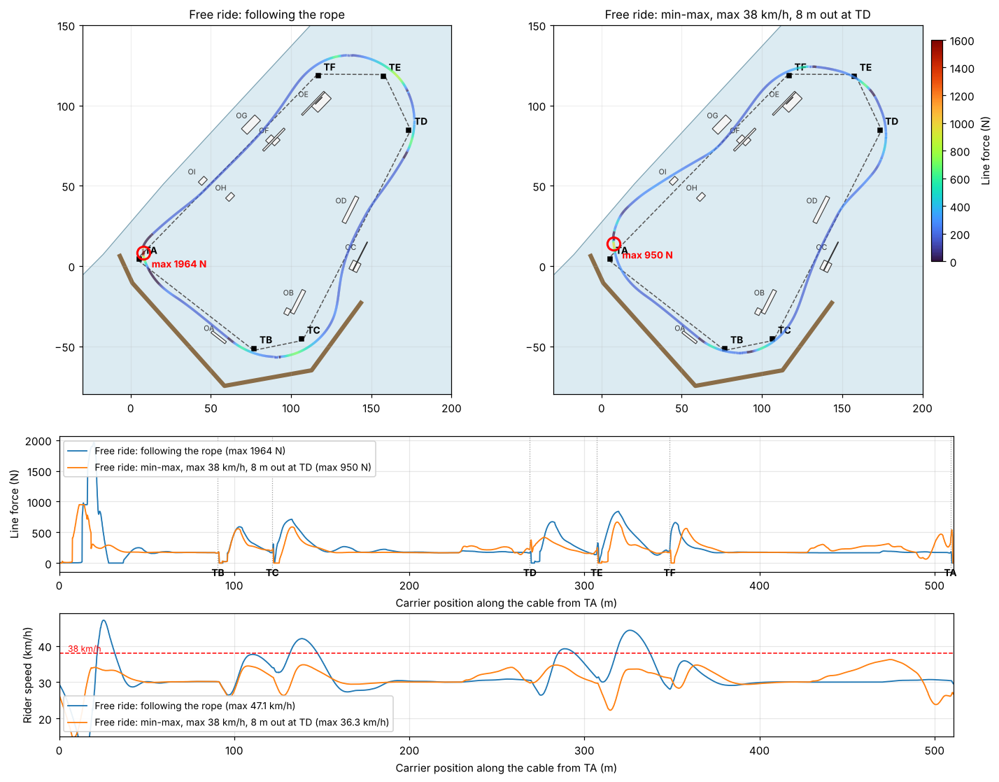
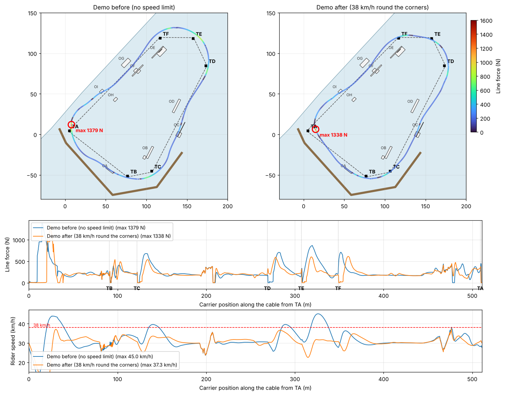

# Corner technique with the smallest peak line force (min-max)

5 Oct 2026. Geometry as in `src/physics.js` after commit `cba111b` (TE sheave at [157.5, 118.2]). Cable 30 km/h,
release limit 2.5 kN (`DEMO_SETTINGS`), 20 m rope. All numbers come from the headless simulator, not from measurements.

Requirements (user, 4–5 Oct 2026): the same three features and tricks in the demo (OC, OI, OA); **max 38 km/h before and
after the corners and on the run-up from TA to OA** (first 35 km/h, raised to 38 to bring the force down; run-ups to
the jumps are exempt); be further to the right before the TD sheave (requirement: ≥ 8 m outside the cable when the
carrier reaches it).

## 1. The course seen from above

| Leg | Length | Time at 30 km/h | Free water on the outside (right) | Features near the line |
|---|---|---|---|---|
| TA→TB | 90.7 m | 10.9 s | 10 → 28 m (jetty) | OA rail 7 m right, u = 69 m |
| TB→TC | 30.2 m | 3.6 s | 18–19 m (jetty) | – |
| TC→TD | 146.2 m | 17.5 s | ≥ 15 m | OC ramps 6–9 m right (u = 55 m), OB 14 m left, OD 11 m left |
| TD→TE | 37.2 m | 4.5 s | open | – |
| TE→TF | 40.6 m | 4.9 s | 35–85 m | – |
| TF→TA | 159.6 m | 19.2 s | 24 → **18 m** (NW shore) | OE, OF, OH left; OG 8 m right; OI 5 m right (u = 97 m) |

| Corner | TB | TC | TD | TE | TF | TA |
|---|---|---|---|---|---|---|
| Turn α | 49.3° | 51.4° | 52.5° | 64.4° | 46.0° | **96.4°** |
| Offset for a taut rope, H·sin(α/2) | 7.6 m | 7.9 m | 8.1 m | 9.7 m | 7.2 m | 13.6 m |

H = √(L² − Δz²) ≈ 18.3 m is the rope's horizontal length. The rope stays at constant length through the sheave without
the rider turning only if its angle to the cable is θ ≥ α/2 (from (Ċ − Ṙ)·ê = 0 with |Ṙ| = |Ċ|). After the sheave he
would then have to turn at 4·v·sin(α/2)/H ≈ 60–80 °/s, while the board turns ≈15 °/s fully edged on a taut line
(`CARVE_SLIP`). He therefore trades going wide (longer, faster path) against turning in early (slack rope that comes
taut later). Going wide also costs speed: the further out, the harder the swing after the sheave. TA is the hard corner:
13.6 m are needed and only 18 m of water separate the cable from the shore.

## 2. Method

The rider is the full model (`createAutopilot` + `createSim`, 240 Hz): turn rate, lean limit (45°), arm yield
(`ARM_YIELD` 950 N), rope sag and cable deflection all apply. Each corner gets a technique (`CORNER_DEFAULT`): edge-out
lean before the sheave, or a set-up line `offset` m outside the cable from `lead` s before the sheave (sideways speed
≤ `vmax`, total speed ≤ `gains.vLim`), and a carve (`carve`° lean) from `turnIn` s before to `carveFor` s after it.
Objective: the largest line force from lap 2 on (start excluded), max over 0 and 8 m/s wind. Penalties: fall; closer
than 4 m to shore or jetty; touching a feature not in the plan; speed > 38 km/h in the corner phases (line, wide,
turn-in, on the water) or on the OA run-up; < 8 m out at TD. Solver: separable CMA-ES per corner, then TA with
the OI crossing and the approach gains. Scripts: `tools/corner_minmax/`.

## 3. Results (laps 2–3, 0–10 m/s wind)

| Rider | Largest line force | Speed round the corners | Out at TD | Out at TA |
|---|---|---|---|---|
| Free ride, following the rope | 1.96 kN | 47 km/h | 4.0 m | 4.0 m |
| Free ride, min-max without speed limit | 0.67 kN | 40 km/h | 6.1 m | 12.0 m |
| Free ride, min-max, ≤ 35 km/h, ≥ 8 m at TD | 0.95 kN (TA) | ≤ 35.0 km/h | 8.1 m | 10.0 m |
| **Free ride, min-max, ≤ 38 km/h, ≥ 8 m at TD** (`FREE_RIDE_CORNERS`) | **0.66–0.67 kN** (TE) | **≤ 37.7 km/h** | **8.1 m** | 11.7 m |
| Demo before (wide at TA only) | 1.38–1.42 kN | 45 km/h | 3.5 m | 8.2 m |
| Demo, ≤ 35 km/h | 1.51–1.53 kN | ≤ 34.8 km/h, 35.8 to OA | 7.3 m | 4.7 m |
| **Demo, ≤ 38 km/h** (`DEMO_CORNERS`, same OC/OI/OA) | **1.34–1.37 kN** (TA) | **≤ 36.8 km/h, 37.1 to OA** | **8.0 m** | 3.5 m |

- **TD further right helps**: in free riding the TD peak drops from 0.65 kN (6.1 m out) to 0.43 kN (8.1 m out).
- **Free riding at ≤ 38 km/h**: TA now goes 11.7 m out (4.0 m from the NW shore, the limit) and is no longer the worst
  corner; the peak is at TE. Same peak as without a speed limit, 2 km/h slower.
- **Demo**: the OA rail 69 m after TA leaves little room to swing wide at TA. Force against speed at TA (blends between
  techniques): 1.5 kN at ≤ 35, 1.34 kN at ≤ 37, 1.3 kN at 41, 1.0 kN at 42–44 km/h. The OI kicker is now crossed 21° to
  the right (was 25° originally) so he lands towards TA's set-up line; TD is ridden with a longer edge-out (8 s).

## 4. Limits

- The optimum is within this family of techniques and this controller, not a proof of a global optimum.
- The speed limit is measured in the corner phases on the water; run-ups, air and landings at OC and OI are exempt
  (up to ≈37 km/h after the landings).
- Positions of the TE sheave, the shore and the features carry several metres of uncertainty; re-run
  `tools/corner_minmax` when they move.
